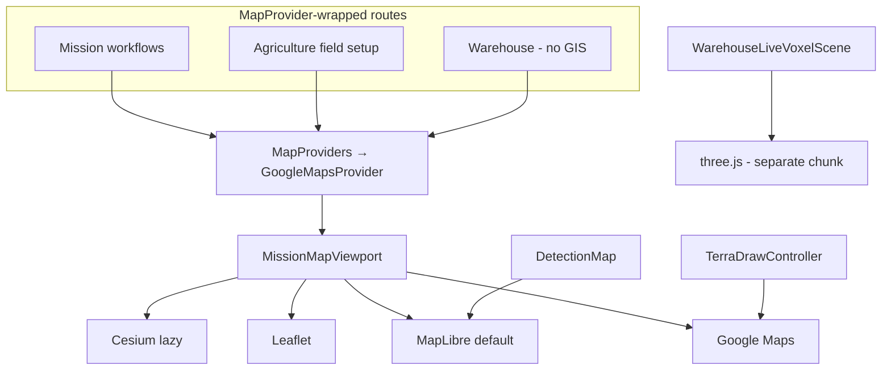

# Map library audit

Audit date: 2026-08-14  
Scope: `frontend/` GIS/mapping dependencies and consumers.  
Task: **1.7** — document usage and removal candidates only (no dependency changes).

## Summary

The frontend ships **four selectable map engines** behind `MissionMapViewport` (Google Maps, MapLibre, Leaflet, Cesium), plus a **standalone MapLibre** widget for video-analysis detections. Warehouse 3D viewing uses **Three.js**, not these GIS libraries.

| Library | Required today? | Removal candidate? |
|---------|-----------------|-------------------|
| `maplibre-gl` | Yes — default mission engine + `DetectionMap` | No |
| `@react-google-maps/api` + `@types/google.maps` | Yes — Google engine, Terra Draw, overlays | No (until drawing/overlays migrate) |
| `cesium` + `vite-plugin-cesium` | Yes — 3D globe, tilesets, photogrammetry | No |
| `leaflet` + `@types/leaflet` | Yes — user-selectable flat-map engine | **Maybe** (consolidate to MapLibre in 1.8+) |
| `terra-draw` + `terra-draw-google-maps-adapter` | Yes — polygon/line drawing on Google Maps | No (Google-only adapter today) |
| `resium` | **No** — zero imports | **Yes** |
| `@googlemaps/js-api-loader` (direct dep) | **No** — loader comes via `@react-google-maps/api` | **Yes** |
| `@nivo/geo` | **No** — zero imports | **Yes** |

## Architecture

- **Central wrapper:** `frontend/src/app/providers/MapProviders.tsx` → `GoogleMapsProvider` (`useJsApiLoader` from `@react-google-maps/api`).
- **Engine switch:** `frontend/src/modules/maps/components/MissionMapViewport.tsx` — `DEFAULT_MISSION_MAP_ENGINE = "maplibre"`.
- **Lazy boundaries:** `CesiumMapLazy`, `LeafletMapLazy`, `MapLibreMapLazy` keep heavy engines out of the initial route chunk when unused.
- **Build chunks** (`vite.config.ts`): `vendor-maps` (maplibre+leaflet), `vendor-google-maps`, `vendor-cesium`, `vendor-3d` (three.js).

## Dependencies (`frontend/package.json`)

### Core map engines

| Package | Version | Role |
|---------|---------|------|
| `maplibre-gl` | ^5.9.0 | Default flat map; video detection map |
| `@react-google-maps/api` | ^2.20.8 | Google Maps React bindings + script loader |
| `@types/google.maps` | dev | Types for `google.maps.*` |
| `leaflet` | ^1.9.4 | Alternate flat map engine |
| `@types/leaflet` | dev | Leaflet types |
| `cesium` | ^1.138.0 | 3D globe, 3D Tiles, mission drawing |
| `vite-plugin-cesium` | dev | Copies Cesium workers/assets to `dist/cesium/` |
| `resium` | ^1.19.4 | **Unused** — Cesium is used imperatively |
| `terra-draw` | ^1.25.0 | Vector drawing toolkit |
| `terra-draw-google-maps-adapter` | ^1.3.1 | Terra Draw ↔ Google Maps (only adapter in repo) |

### Likely-unused direct dependencies

| Package | Evidence |
|---------|----------|
| `@googlemaps/js-api-loader` | No `src/` imports; `@react-google-maps/api` bundles `@googlemaps/js-api-loader@1.16.8` |
| `@nivo/geo` | No `src/` imports (other `@nivo/*` packages used for charts) |
| `resium` | No `src/` imports; `CesiumMap` uses dynamic `import("cesium")` |

## Bundle impact (production build snapshot)

Captured from `frontend/dist/` after `npm run build` (2026-08-14).

| Asset | Size | Notes |
|-------|------|-------|
| `assets/vendor-maps-*.js` | **~1.15 MiB** | MapLibre + Leaflet (shared chunk) |
| `assets/vendor-maps-*.css` | ~84 KiB | MapLibre + Leaflet CSS |
| `assets/vendor-google-maps-*.js` | **~148 KiB** | React wrapper + loader (Google script loaded at runtime from Google CDN) |
| `dist/cesium/Cesium.js` | **~5.5 MiB** | Loaded when Cesium engine selected |
| `dist/cesium/` (total) | **~14 MiB** | Workers, widgets, assets (vite-plugin-cesium) |
| `assets/CesiumMap-*.js` | ~24 KiB | App adapter shell (lazy) |
| `assets/vendor-3d-*.js` | **~941 KiB** | Three.js — warehouse voxel viewer, **not** GIS |

Shell budget (`scripts/check_bundle_budgets.mjs`): index.html must **not** modulepreload Google Maps or Cesium — satisfied; map chunks load on demand.

Runtime note: Google Maps JS API payload is additional network cost outside the Vite bundle (API key via `VITE_GOOGLE_MAPS_JAVASCRIPT_API_KEY` / `VITE_GOOGLE_MAPS_API_KEY`).

## Consumers by library

### MapLibre (`maplibre-gl`)

| Consumer | Route(s) | Why required |
|----------|----------|--------------|
| `maps/adapters/MapLibreMap.tsx` + hooks/adapters under `maps/adapters/maplibre/` | All `MissionMapViewport` routes (default engine) | Primary flat map: boundaries, routes, waypoints, drawing preview |
| `maps/components/MissionMapViewport.tsx` | Same | Default engine selection |
| `video-analysis/components/DetectionMap.tsx` | `/dashboard/video-analysis` | Geo scatter for detections with lat/lon (standalone, not via `MissionMapViewport`) |

**Routes using MapLibre (via mission map or default):**

- `/dashboard/controlled`
- `/dashboard/photogrammetry`
- `/dashboard/animalfarm`
- `/dashboard/property-patrol` (re-exports `private-patrol`)
- `/dashboard/field`
- `/dashboard/agriculture/fields`, `/fields/:fieldId`, `/flights/:flightId` (geometry editor only)
- `/dashboard/warehouse` (wrapped; warehouse scene is Three.js)

### Google Maps (`@react-google-maps/api`, `google.maps`)

| Consumer | Route(s) | Why required |
|----------|----------|--------------|
| `maps/providers/googleMaps.tsx` | All `renderMapRoute()` routes | Loads Maps JS API for child trees |
| `maps/components/MissionMapViewport.tsx` | Mission map routes | Google engine branch + `GoogleMap` |
| `maps/components/TerraDrawController.tsx` | Drawing workflows | **Only** `TerraDrawGoogleMapsAdapter` — requires live `google.maps.Map` |
| `*MapColumn.tsx` overlays | controlled, field-survey, photogrammetry, property-patrol, animal-farm | `OverlayView`, `Polygon`, `Polyline`, `GroundOverlay` on Google layer |
| `agriculture/components/AgricultureGeometryMapEditor.tsx` | Agriculture field setup / planner | Geocoding + Terra Draw boundary edit |
| `maps/hooks/useGooglePointMarkers.ts`, `useDroneMapFollow.tsx` | Google engine sessions | Markers / follow behavior |

**Removal blocker:** Terra Draw has no MapLibre/Cesium/Leaflet adapter in this repo. Dropping Google Maps breaks field-boundary drawing on all mission workflows and agriculture geometry editing.

### Leaflet (`leaflet`)

| Consumer | Route(s) | Why required |
|----------|----------|--------------|
| `maps/adapters/LeafletMap.tsx` | Mission map routes (engine toggle) | Alternate flat engine with same overlay/drawing bridge as MapLibre |
| `maps/components/MissionMapViewport.tsx` | Same | `leaflet` engine branch |
| `mission-workflow/components/MapEngineStatus.tsx` | Dev/diagnostic UI | "Switch to Leaflet" |
| `maps/components/CesiumViewControls.tsx` | Mission map routes | Engine radio includes Leaflet |

**Usage pattern:** Every mission `*MapColumn` passes `leafletMapProps` mirroring `mapLibreMapProps`. Default is MapLibre; Leaflet is operator-selectable fallback.

**Removal candidate (1.8):** Yes *if* product accepts dropping the Leaflet engine toggle and MapLibre covers all flat-map needs. No unique Leaflet-only feature found (drawing uses shared flat-map bridge + Cesium draw for 3D).

### Cesium (`cesium`)

| Consumer | Route(s) | Why required |
|----------|----------|--------------|
| `maps/adapters/CesiumMap.tsx` + `maps/adapters/cesium/*` | Mission map routes | 3D globe, camera modes, globe picking |
| `maps/hooks/useCesium*.ts` | Same | Viewer lifecycle, entities, draw session |
| `photogrammetry/views/PhotoGrammetry.tsx` | `/dashboard/photogrammetry` | Auto-selects Cesium on load |
| Mission hooks (`use*Map.ts`) | field, photogrammetry, property-patrol, etc. | `cesiumFieldBoundary`, `cesiumPlannedRoute`, 3D Tiles URL |

**Unique capabilities:** 3D Tiles (`cesiumFieldTileset.ts`), tilted/follow/orbit camera modes, globe-scale route preview. Photogrammetry workflow depends on Cesium for context mesh/tileset display.

### Terra Draw (`terra-draw`, `terra-draw-google-maps-adapter`)

| Consumer | Route(s) | Why required |
|----------|----------|--------------|
| `maps/components/TerraDrawController.tsx` | See below | Polygon/line/point/rectangle/circle/freehand drawing |
| `mission-workflow/components/WorkflowTerraDrawBridge.tsx` | field-survey, photogrammetry, property-patrol pages | Wires Terra Draw to workflow state |
| `controlled-flight/sections/ControlledFlightMapColumn.tsx` | `/dashboard/controlled` | Direct TerraDrawController |
| `animal-farm/sections/AnimalFarmMapColumn.tsx` | `/dashboard/animalfarm` | Direct TerraDrawController |
| `agriculture/components/AgricultureGeometryMapEditor.tsx` | Agriculture geometry routes | Boundary editing |

Coupled to **Google Maps only** via `TerraDrawGoogleMapsAdapter`.

### Non-GIS “map” surfaces (out of scope for engine removal)

| Surface | Technology | Route |
|---------|------------|-------|
| `AgricultureGeoJsonPreview` | SVG | Agriculture list, analysis, temporal workspace, findings |
| `WarehouseLiveVoxelScene` | `@react-three/fiber` + `three` | `/dashboard/warehouse` |
| `@nivo/*` (bar/line/pie, not geo) | Nivo charts | Dashboard insights |

Agriculture analysis (`/dashboard/agriculture/analysis/:runId`) still uses SVG previews — real GIS map planned in task **2.5**.

## Route → map engine matrix

Routes wrapped with `MapProviders` (`AppRouter.renderMapRoute`):

| Route | Renders GIS map? | Engine(s) used | Notes |
|-------|------------------|----------------|-------|
| `/dashboard/controlled` | Yes | MapLibre default; Google overlays + Terra Draw; optional Cesium/Leaflet | |
| `/dashboard/photogrammetry` | Yes | Cesium on load; all four engines wired | 3D Tiles |
| `/dashboard/animalfarm` | Yes | Same pattern as controlled | |
| `/dashboard/property-patrol` | Yes | Same (via `private-patrol`) | |
| `/dashboard/field` | Yes | Same | |
| `/dashboard/agriculture/fields` | Partial | MapProviders only; **SVG** field overview | Loads Google script unnecessarily |
| `/dashboard/agriculture/fields/:fieldId` | Partial | Geometry editor → full stack | |
| `/dashboard/agriculture/flights/:flightId` | Partial | Planner geometry editor | |
| `/dashboard/agriculture/analysis/:runId` | No GIS yet | MapProviders only; SVG findings | Task 2.5 |
| `/dashboard/warehouse` | No GIS | Three.js voxel viewer | MapProviders wrapper is overhead |

Routes **without** `MapProviders`:

| Route | Map library |
|-------|-------------|
| `/dashboard/video-analysis` | MapLibre via `DetectionMap` only |

## Provider / wrapper inventory

| File | Purpose |
|------|---------|
| `app/providers/MapProviders.tsx` | Route-level Google Maps script loader |
| `modules/maps/providers/googleMaps.tsx` | `GoogleMapsContext`, `useJsApiLoader` |
| `modules/maps/components/MissionMapViewport.tsx` | Multi-engine viewport |
| `modules/maps/hooks/useMapEngine.ts` | Engine state + `mission-map-engine-change` event |
| `modules/maps/hooks/useMissionMapRuntime.ts` | Shared runtime (zoom, cesium mode, follow) |
| `modules/maps/adapters/*Lazy.tsx` | Code-split engine entry points |

## Removal candidates (for task 1.8)

### Safe — zero `src/` consumers

1. **`resium`** — Cesium integrated without React bindings.
2. **`@googlemaps/js-api-loader`** (top-level) — duplicate of transitive dep from `@react-google-maps/api`.
3. **`@nivo/geo`** — unused chart geo package.

Expected bundle impact: small JS savings (packages not in manual chunks today); cleaner `package.json`.

### Conditional — requires product/engine consolidation

4. **`leaflet` + `@types/leaflet`** — Remove only if Leaflet engine toggle and `LeafletMap*` adapters are deleted and MapLibre is the sole flat engine. Would shrink `vendor-maps` chunk (~part of 1.15 MiB; exact split needs build compare).

### Not candidates

- **`maplibre-gl`** — default engine + video analysis.
- **`@react-google-maps/api`** — Terra Draw, overlays, geocoding.
- **`cesium` + `vite-plugin-cesium`** — 3D Tiles and photogrammetry.
- **`terra-draw` + `terra-draw-google-maps-adapter`** — active drawing on Google layer.

### Follow-up optimizations (not 1.8 dependency removal)

- Narrow `renderMapRoute()` to routes that actually mount `MissionMapViewport` or need Google script (exclude warehouse, agriculture analysis/list until real maps land).
- Migrate Terra Draw to a MapLibre adapter (or shared abstraction) before considering Google Maps removal.
- Task **2.5** / **3.x** may replace SVG agriculture previews with MapLibre — do not remove MapLibre.

## Verification checklist (for 1.8)

After any removal:

1. `cd frontend && npm run build && npm run bundle:size`
2. `npm run test` + `npm run test:e2e:smoke`
3. Manual smoke: field-survey boundary draw, photogrammetry Cesium tileset, video-analysis detection map, engine toggle MapLibre ↔ Leaflet ↔ Google ↔ Cesium
4. Confirm `check_bundle_budgets.mjs` still passes (no map preloads in shell)

## Removed in task 1.8

The following **direct** dependencies were removed (zero `src/` consumers per audit):

| Package | Result |
|---------|--------|
| `resium` | Removed from `package.json`; `vite.config.ts` no longer references it in `manualChunks` |
| `@googlemaps/js-api-loader` | Removed; loader still provided transitively by `@react-google-maps/api` |
| `@nivo/geo` | Removed; other `@nivo/*` chart packages unchanged |

**Bundle compare (2026-08-14):** `npm run bundle:size` total **17.57 MiB** before and after — expected, because these packages were not bundled into Vite chunks. Benefit is smaller `node_modules` and dependency surface, not shipped JS.

**Not removed:** `leaflet` — still a user-selectable engine via `MissionMapViewport` (see conditional candidates above).

## Related tasks

- **1.8** — Remove dependencies confirmed above
- **2.5** — Replace agriculture SVG preview with real GIS (`AgricultureAnalysisMap`)
- **3.x** — Map technology consolidation (per roadmap)
