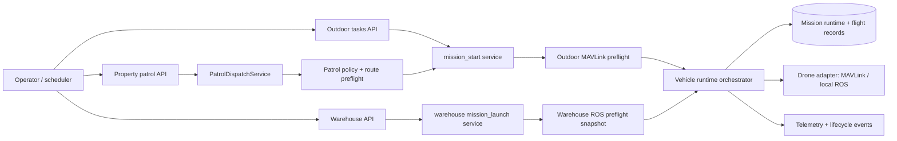

# Mission launch architecture

All launch paths converge on the vehicle runtime. HTTP routers validate identity
and request shape; application services own planning, preflight, persistence, and
dispatch.

Ownership rules:

- Outdoor mission construction and persisted preflight tokens belong to
  `backend/modules/missions/service`.
- Warehouse UI readiness snapshots and background ROS probes belong to
  `backend/modules/warehouse/service/preflight_*`.
- Warehouse flight readiness is a domain gate, not a second mission launcher.
- Property patrol validates site policy first, then delegates real launch to
  `start_mission_for_user`; it must not mark a run dispatched without runtime acceptance.
- Orchestrator construction belongs to `vehicle_runtime/factory.py`; HTTP modules
  never import CLI entrypoints.
